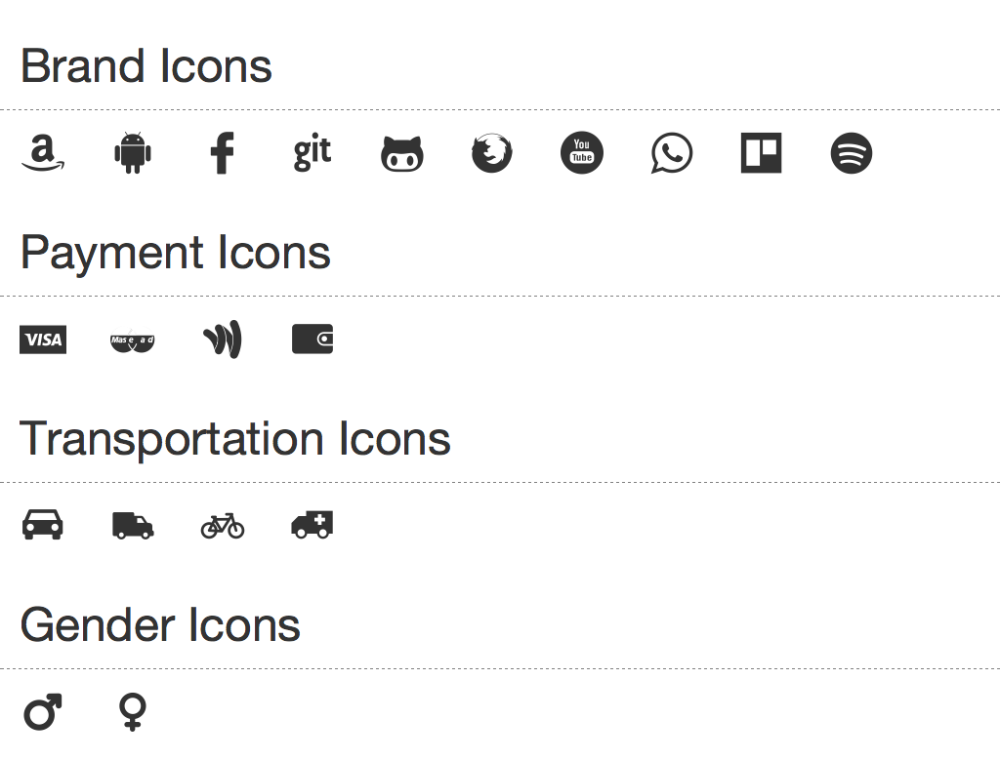

# [LovelyIcons](http://www.douglasdeodato.com/lovelyicons)

## CSS Icons made with Love

## Summary

- [About](#about)
- [Total of Icons](#totaloficons)
- [CDN](#cdn)
- [Request](#request)
- [Dependencies](#dependencies)
- [Creator](#creator)
- [Compiling](#compiling)

## About

## Total of Icons: 81 [see](icons.md)

## CDN
https://cdn.jsdelivr.net/lovely-icons/0.1.4/lovely-icons/lovely-icons.css

## Request or contribute new icons?

The easy way to do this is creating a new [issue](https://github.com/douglasdeodato/lovely-icons/issues/new?title=Icon%20Request:%20li-)

Attach the image or the svg you'd like to add.

## Dependencies ##
* This project uses [fontcustom](https://github.com/FontCustom/fontcustom) to compile vectors into fonts.

## Compiling

$ fontcustom compile svg

## Creator

**Douglas Deodato**

- <http://douglasdeodato.com>
- <https://github.com/douglasdeodato>